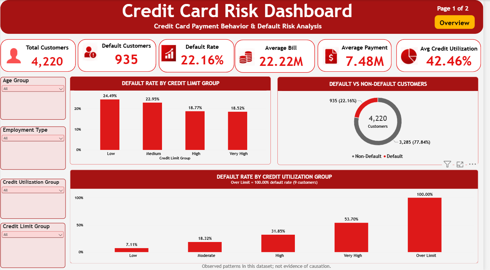
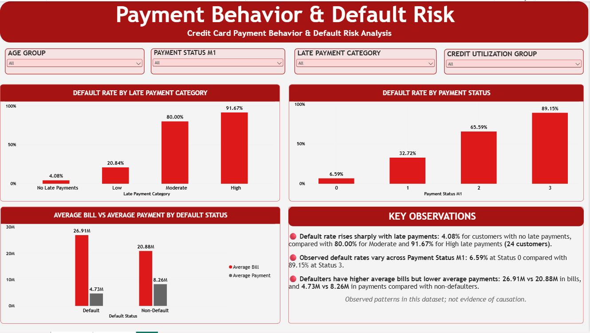

# Credit Card Payment Behavior & Default Risk Analysis

I built this project to understand how credit exposure and payment behavior differ between customers who default and customers who do not. The analysis starts in Excel, moves to MySQL for validation, and ends with a two-page Power BI dashboard.





---

## 1. Introduction

This project analyzes **4,220 credit card customers**, with one row representing one customer.

The data contains information about credit limits, monthly bills and payments, late-payment history, payment-status codes and whether a customer defaults the next month.

The main goal was to identify **observed patterns in default rates** across different customer and payment-behavior groups.

I also wanted the results to stay consistent from one stage to the next, so the project follows one complete workflow:

**Excel → SQL → Power BI**

---

## 2. Business Problem

A bank or card issuer needs a simple way to understand where default risk appears in its customer base.

This project focuses on questions such as:

- How many customers are defaulting?
- Does default rate change across credit-limit groups?
- Does higher credit utilization show higher observed default rates?
- Do customers with more late payments default more often?
- How does Payment Status M1 relate to default?
- Do defaulters bill and pay differently from non-defaulters?

The goal is to create a clear view of **customer credit exposure and payment behavior** so groups that may need further review can be identified.

> The results show patterns in this dataset. They do not prove that any single factor causes default.

---

## 3. Dataset

The final project uses a **4,220-customer prepared dataset**, with one row per customer and unique `CustomerID` values.

| Detail | Information |
|---|---|
| Project Domain | Finance / Credit Risk |
| Customers | 4,220 |
| Default Customers | 935 |
| Non-Default Customers | 3,285 |
| Overall Default Rate | 22.16% |
| Target Field | `DefaultNextMonth` (0 = Non-Default, 1 = Default) |
| Raw Columns | 21 |
| Currency / Monetary Unit | Not specified in the source dataset |

### Fields used from the raw data

`Age`, `Gender`, `Education`, `MaritalStatus`, `EmploymentType`, `MonthlyIncome`, `CreditLimit`, `MonthsWithBank`, `PaymentStatus_M1`, `PaymentStatus_M2`, `PaymentStatus_M3`, `BillAmount_M1`, `BillAmount_M2`, `BillAmount_M3`, `PaymentAmount_M1`, `PaymentAmount_M2`, `PaymentAmount_M3`, `CashAdvance_M1`, `LatePayments_6M` and `DefaultNextMonth`.

### Fields created for analysis

| Field | Rule |
|---|---|
| `Age_Group` | 21–29, 30–39, 40–49, 50–59, 60+ |
| `Credit_Limit_Group` | Low < 40M, Medium 40M to < 60M, High 60M to < 100M, Very High ≥ 100M |
| `Average_Bill` | Average of `BillAmount_M1`, `BillAmount_M2` and `BillAmount_M3` |
| `Average_Payment` | Average of `PaymentAmount_M1`, `PaymentAmount_M2` and `PaymentAmount_M3` |
| `Credit_Utilization` | `Average_Bill / CreditLimit` |
| `Credit_Utilization_Group` | Low ≤ 25%, Moderate > 25% to 50%, High > 50% to 75%, Very High > 75% to 100%, Over Limit > 100% |
| `Late_Payment_Category` | 0 = No Late Payments, 1–2 = Low, 3–4 = Moderate, 5+ = High |
| `Credit_Utilization_Sort` | Excel-only helper used to keep utilization groups in the intended order |

`PaymentStatus_M1`, `PaymentStatus_M2` and `PaymentStatus_M3` are coded values from 0–3. Their business meaning is not defined in the source dataset.

`CardsHeld` was removed from the project and is not used anywhere in the analysis.

---

## 4. Tools Used

| Tool | How I used it |
|---|---|
| **Excel** | Data cleaning, derived fields, Data Dictionary, Business Questions and PivotTables |
| **MySQL** | Data validation, KPI calculations and queries for the six business questions |
| **Power BI** | Two-page interactive dashboard |
| **DAX** | KPI measures and default-rate calculations |

---

## 5. What I Did

### Excel

- Kept the prepared customer data in `RAW_Data` and `Clean_Data`.
- Created analysis fields for age, credit limits, average bill, average payment, credit utilization and late-payment categories.
- Documented the fields in `Data_Dictionary`.
- Defined the analysis questions in `Business_Questions`.
- Built six PivotTables (`PT01`–`PT06`) in `Pivot_Analysis`.
- Used the PivotTables to validate the calculations and business-question results.

### SQL (MySQL)

- Loaded the cleaned data into the `credit_card_clean` table.
- Left out `Credit_Utilization_Sort` because it is an Excel-only sorting helper.
- Ran validation checks for row count, duplicate `CustomerID` values, NULLs and valid `DefaultNextMonth` values.
- Wrote queries for the six business questions.
- Compared the SQL results with the Excel PivotTables.
- Added a small supporting analysis for default rate by age group.

### Power BI

- Loaded `Clean_Data` as a single analysis table.
- Used one table, so no relationships were required.
- Created a `Default Status` column:
  - `0 = Non-Default`
  - `1 = Default`
- Created 11 DAX measures for KPIs and page-level analysis.
- Built a two-page dashboard with KPI cards, charts and slicers.
- Added tooltip context for the small `Over Limit` and `High` late-payment groups.

---

## 6. Metrics I Created

```text
Default Rate
= Default Customers ÷ Total Customers

Average Bill
= AVERAGE(BillAmount_M1, BillAmount_M2, BillAmount_M3)

Average Payment
= AVERAGE(PaymentAmount_M1, PaymentAmount_M2, PaymentAmount_M3)

Credit Utilization
= Average_Bill ÷ CreditLimit
